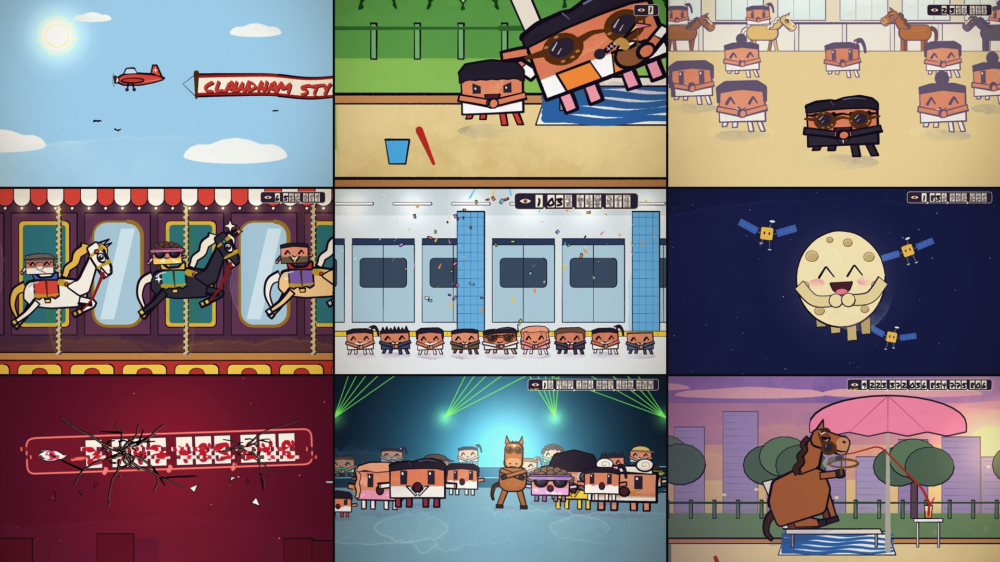
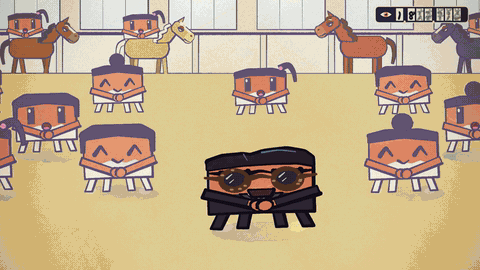
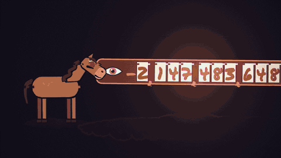
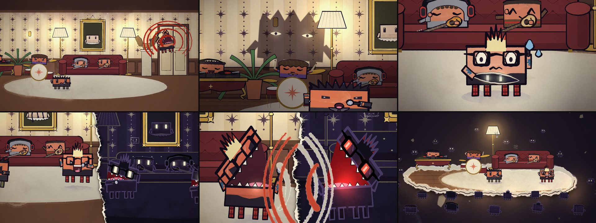

# Music Video, Reimagined

**A Claude skill that remakes any music video as a hand-painted cartoon starring Clawd.** It plays the whole song,
locks every frame to the beat, and has a team of Claude agents build it.



> **Built on [John Heibel's ClaudeAnimationBase](https://github.com/JohnHeibel/ClaudeAnimationBase)**, the painting
> engine and Clawd character from his music video
> [*I'm Upping My P(doom)*](https://github.com/JohnHeibel/PDoomVideo). This skill wouldn't exist without his work.
> Full credits are [below](#credits).

## Made with it

**CLAWDNAM STYLE: the dance that broke the counter.** PSY's "Gangnam Style", reimagined. A kid in a sandbox starts
the dance and it spreads to the whole world. A painted view counter follows it all the way to 2,147,483,647, then
overflows: a nod to the real day this song's video broke YouTube's 32-bit view counter. Through all of it, one horse
refuses to dance, until the very end.

<p>
  
  
</p>

- 3:47, the full song, 24 fps: 5,460 frames painted in watercolour and ink
- 14 chapters built in parallel by 14 Claude subagents, then reviewed and stitched together
- the real choreography (the gallop with the reins, the lasso, the hip sway), studied frame by frame from the
  original and locked to the beat
- the song's beat grid measured to the millisecond (132 BPM), with the sync checked in the final file

**Papercut.** Linkin Park's "Papercut", reimagined. The cartoon is painted on paper, so a *papercut* is a slit in the
page, and behind it is an ink world where the band's dark doubles live.



The films aren't posted here: the songs belong to their owners.

## What the skill does

1. **Studies the source video** frame by frame: its sets, cast, signature moves and structure.
2. **Maps the song**: tempo, beat grid, bars, sections, dropouts and the biggest hits, then verifies the sync.
3. **Finds a concept**: one visual idea that joins the song's meaning to a painted paper world, and escalates to the
   end.
4. **Builds the foundation**: an on-model cast (the artists reimagined as Clawds), sets, and model sheets checked
   before any scene is animated.
5. **Runs a team**: one chapter per song section, built in parallel by subagents from a shared guide, with every
   handoff between chapters specified.
6. **Reviews the film**: every chapter, every seam, every frame.
7. **Renders and delivers**: sound effects for the silences, a master file, a 1080p file and a small preview.

## Install

**Claude Code**

```bash
git clone https://github.com/am-will/music-video-reimagined.git
cp -r music-video-reimagined/skills/music-video-reimagined ~/.claude/skills/
```

**Claude apps:** download `music-video-reimagined.skill` from
[Releases](https://github.com/am-will/music-video-reimagined/releases) and add it as a skill.

**You'll need** Node.js, Google Chrome, ffmpeg, yt-dlp, and Python 3 with numpy and Pillow. The skill clones
ClaudeAnimationBase itself.

## Use it

> Remake this music video with Clawd characters, and keep the famous dance: https://youtu.be/...

Plan for a big job: several hours, heavy token use, and around a dozen agents.

## What's inside

| path | what it is |
|---|---|
| `skills/music-video-reimagined/SKILL.md` | the pipeline, start to finish |
| `skills/music-video-reimagined/references/` | one guide per phase, plus video types, dance videos and lessons learned |
| `skills/music-video-reimagined/scripts/` | download, song analysis, audio trim and sync check, sound effects, encoding, frame QA |
| `skills/music-video-reimagined/assets/engine/` | extensions to the ClaudeAnimationBase engine (costumes, poses, singing mouths, effects) |
| `skills/music-video-reimagined/assets/dance/` | a beat-locked move library for reproducing real choreography |
| `skills/music-video-reimagined/assets/example-*/` | the complete Gangnam and Papercut projects (no audio) |

## Credits

- **John Heibel** made [ClaudeAnimationBase](https://github.com/JohnHeibel/ClaudeAnimationBase) (MIT License): the
  painting engine, the Clawd character rig, the renderer, and the animation guide whose rules this skill follows. The
  engine files in this repo are modified copies of his code, and his license is kept in
  [`LICENSE-ClaudeAnimationBase`](skills/music-video-reimagined/LICENSE-ClaudeAnimationBase).
- **John Heibel** also made [*I'm Upping My P(doom)*](https://github.com/JohnHeibel/PDoomVideo), the music video the
  kit came from. It's the model for this skill's team workflow: one chapter per song section, parallel subagents
  briefed by a written guide, and the shape of the storyboard. No code from that repository is included.
- [p5.js](https://p5js.org) (the Processing Foundation) and [p5.brush](https://github.com/acamposuribe/p5.brush)
  (Alejandro Campos Uribe) do the painting.
- **Clawd** is Anthropic's mascot. This is an unofficial fan project, not affiliated with or endorsed by Anthropic.
- The example films are fan homages to **PSY's "Gangnam Style"** and **Linkin Park's "Papercut"**. No audio,
  footage or lyrics from either is included here; the songs and their videos belong to their owners.
- Built with Claude Opus 5.5 in Claude Code.

## A note on music rights

The songs you remake are copyrighted. Keep your films for personal use, or get permission before you publish one:
platforms may mute or remove videos that use them.

## License

MIT for this repository's own work: see [LICENSE](LICENSE). Code derived from ClaudeAnimationBase keeps its original
MIT notice (© 2026 John Heibel).
